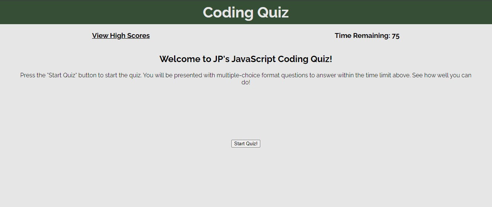
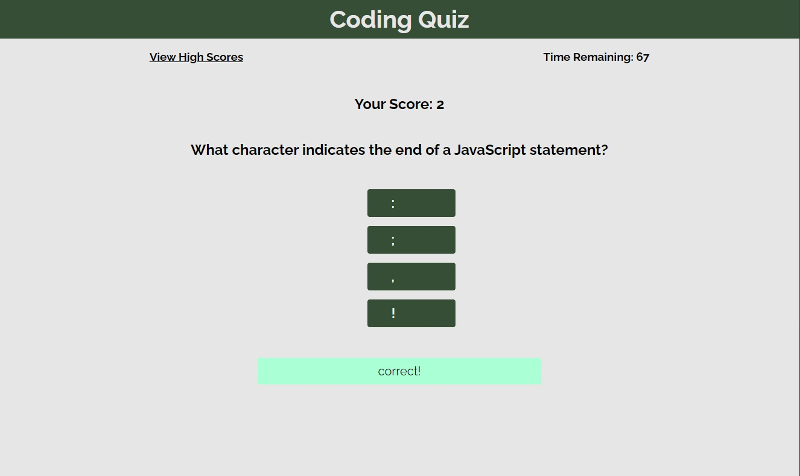
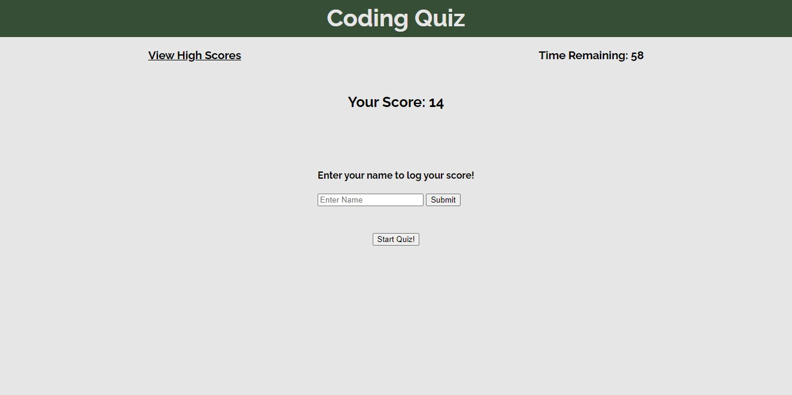

# JP's Coding Quiz

## Description

Provide a short description explaining the what, why, and how of your project. Use the following questions as a guide:

- What was your motivation?
- Why did you build this project? (Note: the answer is not "Because it was a homework assignment.")
- What problem does it solve?
- What did you learn?

## Installation

N/A

## Usage

To access the quiz, follow this [link](https://ajprobel.github.io/coding-quiz/)

Once on the page, you will be greeted with a simple site that has a message about the quiz, a timer (inactive), a link to view high scores (if available), and a button to start the quiz.

Upon pressing the button, the timer will start counting down, and the first question of the quiz appears. The quiz is in multiple-choice format; after reading the question, please select and click the answer that fits the question the best.

The quiz ends either when the timer runs out, or you complete all of the questions.

Enter your name and submit to have your name and score saved in local storage!

*coming soon* The "View High Score" button doesn't currently work. It will be fixed by the next iteration.

## Credits

Designed and created by me, James Probel, with guidelines from the UNC Chapel Hill Programming Bootcamp.

Thank you to MDN Web Docs for providing guidelines on query selectors, event listeners, appending/removing elements, and helping to provide wording on the questions on the quiz (using their definitions)
https://developer.mozilla.org/en-US/docs/Web/API/Document/querySelectorAll
https://developer.mozilla.org/en-US/docs/Web/API/EventTarget
https://developer.mozilla.org/en-US/docs/Web/API/Element/remove

## License